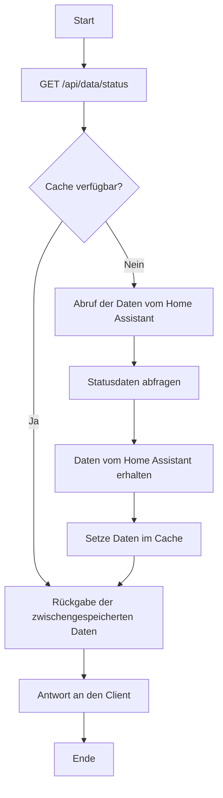

# Aktivitätsdiagramm für den Aufruf von /api/data/status

```mermaid
graph TD
    A[Start] --> B[GET /api/data/status]
    B --> C{Cache verfügbar?}
    C -->|Ja| D[Rückgabe der zwischengespeicherten Daten]
    C -->|Nein| E[Abruf der Daten vom Home Assistant]
    E --> F[Statusdaten abfragen]
    F --> G[Daten vom Home Assistant erhalten]
    G --> H[Setze Daten im Cache]
    H --> D
    D --> I[Antwort an den Client]
    I --> J[Ende]

```
