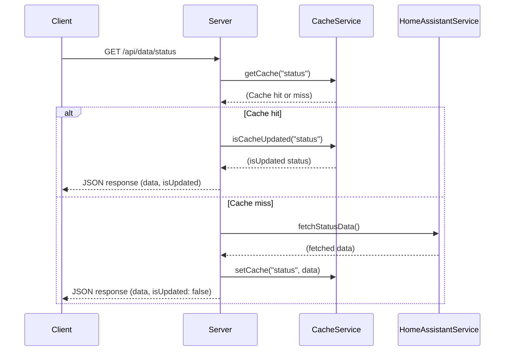

# Backend Sequence-Diagramm

```mermaid
sequenceDiagram
    participant Client
    participant Server
    participant CacheService
    participant HomeAssistantService

    Client->>Server: GET /api/data/status
    Server->>CacheService: getCache("status")
    CacheService-->>Server: (Cache hit or miss)

    alt Cache hit
        Server->>CacheService: isCacheUpdated("status")
        CacheService-->>Server: (isUpdated status)
        Server-->>Client: JSON response (data, isUpdated)
    else Cache miss
        Server->>HomeAssistantService: fetchStatusData()
        HomeAssistantService-->>Server: (fetched data)
        Server->>CacheService: setCache("status", data)
        Server-->>Client: JSON response (data, isUpdated: false)
    end
```
