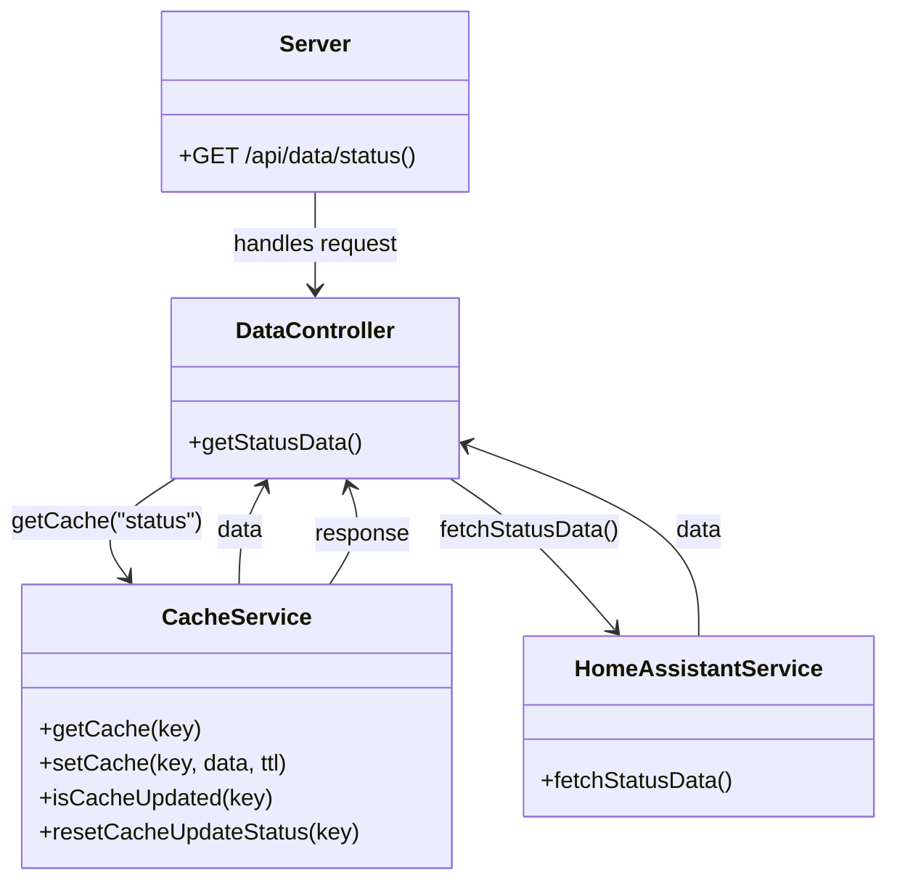

# Backend UML-Diagramm

```mermaid
classDiagram
    class Server {
        +GET /api/data/status()
    }

    class CacheService {
        +getCache(key)
        +setCache(key, data, ttl)
        +isCacheUpdated(key)
        +resetCacheUpdateStatus(key)
    }

    class HomeAssistantService {
        +fetchStatusData()
    }

    class DataController {
        +getStatusData()
    }

    Server --> DataController : handles request
    DataController --> CacheService : getCache("status")
    DataController --> HomeAssistantService : fetchStatusData()
    DataController <-- CacheService : data
    DataController <-- HomeAssistantService : data
    CacheService --> DataController : response
```
